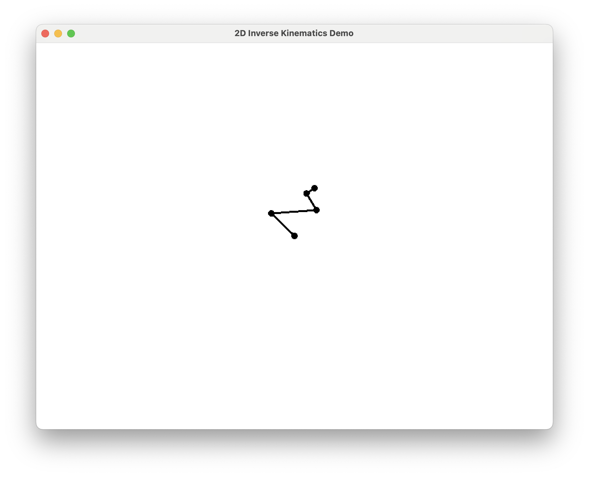

# 2d-inverse-kinematics-demo
A small demo implementing 2d inverse kinematics using my take on cyclic coordinate descent - uses SFML. Only tried building for the ARM Macs but as long as you link SFML properly it should compile easily on most platforms.

To compile set up an SFML project and drop this in as your main file.

